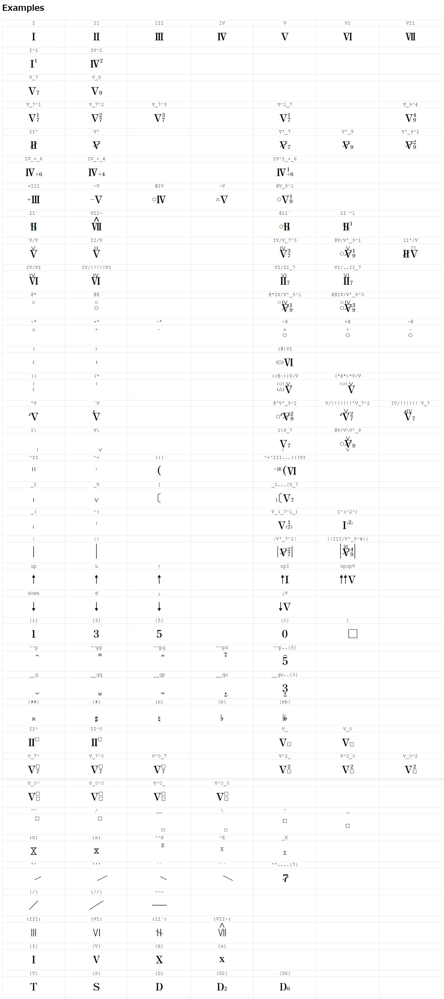

# Hamori JP

Ligature (合字) が有効な環境向けの日本式和音記号フォント

## Features

- 各グリフは以下のオープンフォントをベースに合成
  - [Zen Antique](https://github.com/googlefonts/zen-antique)
  - [Zen Kaku Gothic Antique](https://github.com/googlefonts/zen-kakugothic)
  - [Leland](https://github.com/MuseScoreFonts/Leland)
- 独自グリフの追加
  - ナポリの II
  - 変位 VII
  - 上下に線がある X
- より直感的に・スムーズに入力するために合字機能を利用
  - 例: 属七の 1 転 → `V_7^1`

## Installation

OTF, WOFF, WOFF2 を用意しているので適当なものをダウンロードしてインストール

## Disclaimer

個人用です

安定版ではないので Ligature の割り当てや表示は予告なく変更します

バグ・要望等は Issue へ

## License

SIL Open Font License 1.1

## [Examples](./examples.html)

